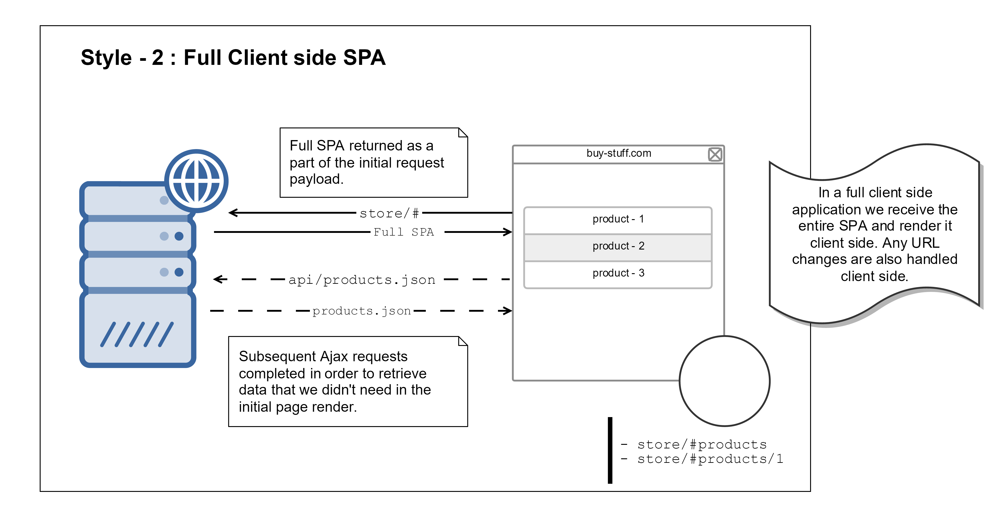

footer: @cylim226
slidenumbers: true
theme: Next, 1


# [fit] Server Side Rendering
#### Ruby Tuesday and JavaScript Meetup #2

^ why front-end development is moving back to SSR

[.slidenumbers: false]
[.hide-footer]

---


## Hi, I’m CY

### Full Stack Software Engineer

#### @cylim226

^ Mainly convert UI into code

[.slidenumbers: false]
[.footer: Ruby Tuesday and JavaScript Meetup #2]

---


# History

^ This is not apply for everyone but a trend

---

# [fit] Monolithic Applications


^ The traditional way, a lot companies still using it in some points. e.g. Wordpress
^ html template and serving by the server back-end

---

# Client-Server Architecture

- SOAP & RESTful APIs
- Ajax & JQuery
- Mobile App Development

^ SOAP is there long time ago, mostly used to consume third party
^ In-house prefer monolithic

^ Ajax (2005) & jQuery (2006)
^ People starting to do some simple http request on front-end
^ Some static website can have dynamic data

^ App Store (2008)
^ Server directly serving html is not longer an option
^ RESTful API become a trendy stuff

^ Server write one and serve everywhere
^ Scaling the server

---



---

## Ruby on Rails 5.0

### Official API Mode

^ Just a mention
^ Rails 5.0 released API mode (2016). It shows why this is a trend.
^ Don't get me wrong, you still able to render json, xml in older version.

---

# Microservices 
# Serverless

^ Just bring it up, nothing to do with today talks.
^ Microservices docker meetup
^ Serverless, can have a topic about it in future meetups

---

# Back to topic

^ When we do Client side, we need to serve a javascript file to client
^ client can only decide what to render, how to handle pages

---

# Bundle.js

``` js
$ yarn build
Version: webpack 4.16.3
Time: 32340ms
            Asset     Size  Chunks
    dist/main.js  3.29 MB       0  [emitted] [big]
dist/main.js.map  13.7 MB       0  [emitted] [big]
```

^ huge bundle
^ Okay, maybe we can compress it

---

# Compression

``` js
$ yarn build
Version: webpack 4.16.3
Time: 18324ms
            Asset     Size  Chunks
    dist/main.js  1.17 MB       0  [emitted] [big]
dist/main.js.map  464  bytes    0  [emitted]
```

^ map file not for production
^ error reporting tools

^ How about code splitting
^ vendor and main? Not practical
^ By routes?

---

# Code Splitting

``` js
File sizes after gzip:

  252.35 KB  static/js/main.edc1ecb9.js
  185.04 KB  static/js/1.7ceb0496.chunk.js
  156.72 KB  static/js/4.d6be737a.chunk.js
  124.23 KB  static/js/2.cc44f42f.chunk.js
  102.56 KB  static/js/3.faf19ea5.chunk.js
  87.24 KB   static/js/0.9eacede5.chunk.js
  85.28 KB   static/js/5.11b66b7f.chunk.js
  77.43 KB   static/js/7.dc93c87a.chunk.js
  52.78 KB   static/js/6.5c9e667e.chunk.js
```

^ It seems small enough
^ what is the issues?
^ what happen if browser download 100kb jpg vs 100kb js

---

# Comparisons

|  JPEG |  JavaScript |
| :-----------: | :-----------: |
| Request & Download | Request & Download |
| Progressive Render* | Decompress* |
| Lazy Load* | Repaint & Reflow* |
| | Render Blocking |

^ To be honest, I doesn't sure about how browser handled JavaScript and it may different from different engine
^ Progressive render needs extra works or using WebP
^ code spliting is lazy load for js

^ https://cloudinary.com/blog/an_introduction_to_progressive_image_rendering
^ https://github.com/aFarkas/lazysizes
^ https://github.com/verlok/lazyload

---

# [fit] Server Side Rendering

^ After a big round
^ we are going back to server rendering

^ why?
^ faster initial load
^ better SEO

^ but there is different for separation of frontend app and API server vs monolithic designs
^ Micro services
^ Easier for scaling, scale only the part need to be scale

---

# React on Rails[^1]

```xml
<%=
    react_component("HelloWorld",
    props: @hello_world_props, 
    prerender: true)
%>
```

[^1]: https://github.com/shakacode/react_on_rails

^ This won't be perfect example
^ Makes use of Rails repond_to format.html
^ It is still like a monolithic apps, but Rails can be used to serve Mobiles with json response

^ Technically, It is possible to make the initial load go thru the server and following load with API requests.
^ I will look into that as well.

^ I would try to demostrate server-side rendering for the next talk... :)
