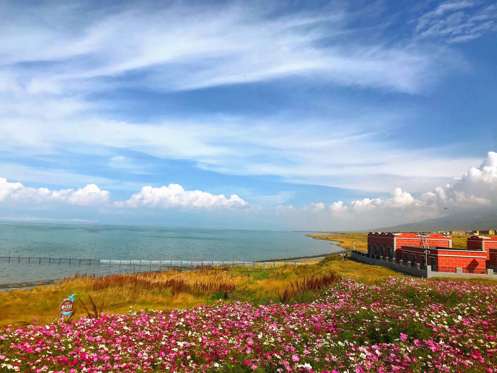

footer: @cylim226
slidenumbers: true
theme: Next, 8

# [fit]Back-end with Nodejs

#### Ruby Tuesday and JavaScript Meetup #4

[.slidenumbers: false]
[.hide-footer]

---

## Hi, I’m CY

### Full Stack Software Engineer

#### @cylim226

^ Mainly convert UI into code

[.slidenumbers: false]
[.footer: Ruby Tuesday and JavaScript Meetup #4]

---

# RESTful APIs

^ Basic CRUD operations with HTTP request
^ Flask vs Django
^ Express vs Sailjs
^ Rails

---

## Instructions

1. Download and install [Nodejs](https://nodejs.org/en/);
2. Initialize project;
`npm init || yarn init`
3. Install packages;
`npm i -s express || yarn add express`
4. Check what is added;
`npm list --depth 0 || cat package.json`

---

# DEMO

^ show package.json

---

# WebSocket / WebRTC

^ STUN/TURN
^ Direct Connection - STUN
^ Relay Connection - TURN

---

# DEMO

---

# GraphQL

^ New generation query language
^ GraphQL Subscription ~= WebSocket

---

# [fit]Submit your talks[^1]

[^1]: [https://github.com/JSMY/talks](https://github.com/JSMY/talks)

^ What's next? 
^ Firebase, React or GraphQL
