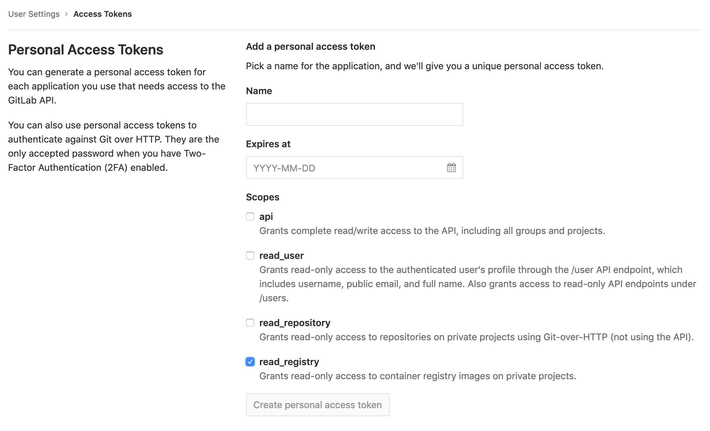

footer: @cylim226
slidenumbers: true
theme: Next, 8


# CI/CD with Docker
#### Docker Bday #6: How do YOU #Docker?

[.slidenumbers: false]
[.hide-footer]

---


## Hi, I’m CY

### Full Stack Software Engineer

#### @cylim226

[.slidenumbers: false]
[.footer: Docker Bday #6: How do YOU #Docker?]


^ freelancer
^ small scale, fast feedback
^ Orchestration won't be part of this topic

---

## What is CI/CD Pipelines?

1. Trigger multi stage tasks to produce certain outcomes
2. Automation the Integration and Deployment process

^ Q: know CI pipelines
^ Q: use CI pipelines
^ We have to go thru a few simple terminology
^ Remember old practices
^ This is not the official description for it


---

## Not covered

1. Run a services for each pull request[^1]
2. Run a comprehensive test with docker local database[^2]
3. Orchestration


^ It is not my business requirement
^ Good to have

[^1]: [CI preconfigured variables](https://docs.gitlab.com/ee/ci/variables/) - CI_MERGE_REQUEST_ID

[^2]: seed the data, no dirty data


---

## Why I choose Gitlab CI?

1. Free tier for private usage[^3]
2. No need any extra manual setup[^4]
3. Come with Gitlab repo
4. In case if needed more minutes[^5]

^ Q: Git repo

[^3]: [Gitlab Pricing](https://about.gitlab.com/pricing/)

[^4]: [Features Comparison](https://about.gitlab.com/pricing/gitlab-com/feature-comparison/)

[^5]: [Install and Register your own runner](https://docs.gitlab.com/runner/register/index.html)

---


## Basic Configuration


```yaml
image: docker:git

stages:
  - build
  - test
  - deploy
  - production

services:
    - docker:dind #docker engine and docker compose

variables:
  IMAGE_TAG: $CI_REGISTRY_IMAGE:$CI_COMMIT_SHA
  LATEST_IMAGE: $CI_REGISTRY_IMAGE:latest
  STAGING_IMAGE: $CI_REGISTRY_IMAGE:staging
```

^ Start with declaring

---

## Creating reusable functions

``` yaml
.login_and_pull: &login_and_pull
  before_script:
    - docker login -u gitlab-ci-token \
      -p $CI_BUILD_TOKEN registry.gitlab.com
    - docker pull $LATEST_IMAGE

.push_to_server: &push_to_server
  script:
    - Your script to push to server
    - Request your ochestration tools to 
      - upgrade the services using latest image tag
    - Push your image tag to another registry

```

^ Some script for reusable

---

## Example for Using AWS ECR

```yaml
# AWS_ACCESS_KEY_ID and AWS_SECRET_ACCESS_KEY environment variables
- aws ecr get-login --no-include-email --region $AWS_REGION
- docker tag $IMAGE_TAG $ECR_IMAGE:$TAG
- docker push $ECR_IMAGE:$TAG

# Update Services
- aws ecs register-task-definition \
  --cli-input-json file://$TASK_DEF_FILE --region $AWS_REGION
- aws ecs update-service --cluster $CLUSTER_NAME \
  --service $SERVICE_NAME --task-definition $TASK_DEF_NAME \
  --region $AWS_REGION

```

---

## Example for using Gitlab Registry



---

## Declaring build stage

```yaml
build_dev:
  stage: build
  except:
    - master
  <<: *login_and_pull
  script:
    - docker build --cache-from $LATEST_IMAGE -t $IMAGE_TAG  . > /dev/null
    - docker push $IMAGE_TAG > /dev/null

build_staging:
  stage: build
  only:
    - master
  <<: *login_and_pull
  script:
    - docker build --cache-from $LATEST_IMAGE -t $IMAGE_TAG  . > /dev/null
    - docker push $IMAGE_TAG > /dev/null
    - docker tag $IMAGE_TAG $STAGING_IMAGE
    - docker push $STAGING_IMAGE > /dev/null
```

^ Except and Only
^ build_dev is just a showcase in this example
^ Doesn't included Test and dynamic port deployment

---

## Deployment[^6]

``` yaml
deploy_staging:
  stage: deploy
  only:
    - master
  environment:
    name: staging # Affect by Gitlab environment variables
  <<: *push_to_server
```

[^6]: [environment for paid user only](https://gitlab.com/help/ci/variables/README#limiting-environment-scopes-of-variables-premium)

---

## After client review

```yaml
deploy_production:
  stage: production
  image: cdrx/rancher-gitlab-deploy
  only:
    - master
  when: manual
  <<: *push_to_rancher
```

^ You can use another base image
^ You can trigger the deployment or test manually
^ Rancher is an orchestration tools, it is too broad to cover
^ I didn't create a test project for this talk

---

## What's next?

1. Auto DevOps[^7]
2. Knative[^8]

^ What I might look into in future
^ requirements - base domain constraints

[^7]: [Gitlab Auto DevOps](https://gitlab.com/help/topics/autodevops/index.md)

[^8]: [Serverless with k8s](https://github.com/knative/)

---


# 🥳 🥳 🥳